# Simple-Movie-Booking-Chat-Bot
This is repository is aimed at helping anyone get started with understanding how to use Watson Assistant service to create a simple chat bot that will book seats to a movie for you.

# Watson Assistant
The [Watson Assistant](https://www.ibm.com/watson/ai-assistant/) service available as a Platform as a Service (PaaS) on IBM Cloud provides a AI tooling that can easily allow creating converstaional solutions that fits one's business needs. 

# Basic Concepts & Terminologies
## Workspace
A workspace in Watson Assistant is a container for all artifacts that define the behaviour of your system, i.e. Chatbot.

## Utterance
An utterance or user example is an input that a user provides when prompted, including questions and statements.

## Intent
An intent is the purpose expressed by user input, which usually acts as a label for a group of utterances.
For instance, if "Where can I find the gym?" is the question provided by a user, the Watson Assistant service understands that the user’s intent is to ask about the location of something (in this case, the gym, which is called the entity).

## Entity
An entity is usually a classification of objects aimed to help alert the response to an intent.
Using the same example of the user asking "Where can I find the gym?", the Watson Assistant service understands that the entity being asked about is the gym. The entity could have been something else like the restaurant, to which the Watson Assistant service would have provided a different response, despite the intent being the same.

## Context
Context is information gathered from an external source to customize responses.

## Response 
A response is what the Conversation service returns to the user’s utterances based on the detected intent, and entity can be in the form of text or an action like displaying a map.

## Dialog
A dialog defines the conversational flow, which is simply a logical flow that determines responses based on a met condition. The dialog flows in a top-to-bottom, left-to-right fashion.

## Dialog Node
A diaglog node is a single interaction in a conversation that is triggered when a condition is met and provides a response back to the user.

# Process 
## Sign up on IBM Cloud
An IBM Cloud account - A lite account, which is a free of charge account that doesn’t expire, can be created through going to [IBM Cloud](http://ibm.biz/childrenday).

## Create a Watson Assistant service
1.  Select **Catalog** found at the top right of the page.
2.  Click on **Watson** from the menu on the left, which you can find under **Platform** services.
3.  Select **WWatson Assistant (formerly Conversation)**.

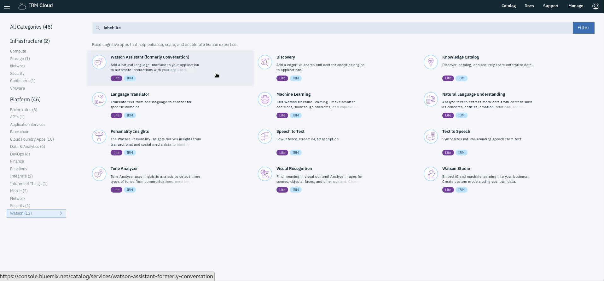

4.  Enter the **Service name** or keep the default value and make sure to select the **US South** as the **region/location** and your desired **organization**, and **space**.
5.  Select **Lite** for the **Plan**, which you can find under **Pricing Plans** and is already selected. Please note you are only allowed one instance of a Lite plan per service.
6.  Click on **Create**.

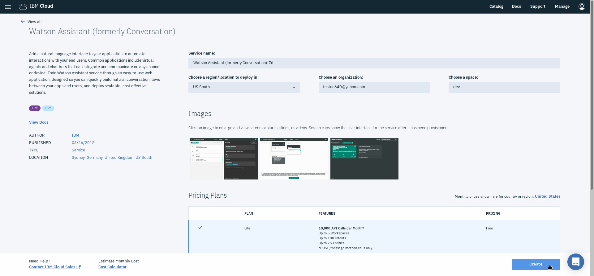

7.  You will be taken to the main page of the service. Click on **Launch tool**.

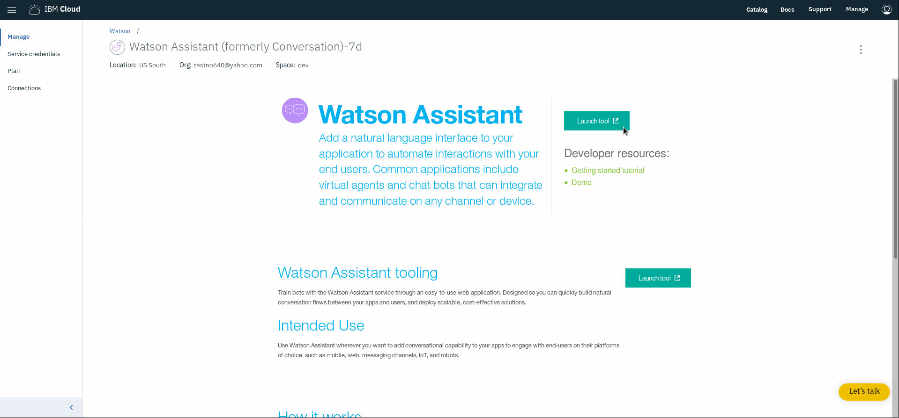

## Create a Workspace
1.  Scroll down and click on **Create a Workspace** found under **Get started now**

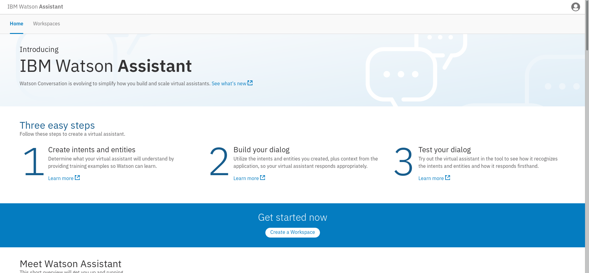

2.  Click on **Create** found in the dotted box that is titled **Create a new workspace**.
3.  Give your workspace a **Name** and **Description** (optional) based on the purpose of the conversational solution (We will call the workspace *Simple Movie Booking Bot*).
4. Click *Create*. This will open the workspace, where you will define the **Intents**, **Entities** and **Dialog**.

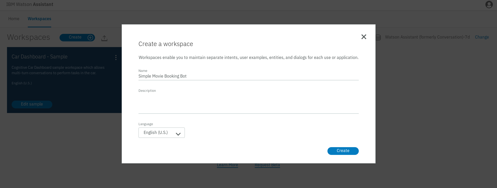

## Define Intents
For the intents, we can define 3 main intents that the user will have: greeting the bot (#greeting), thank the bot for accomplishing the task (#thankyou), and booking movie ticket(s) (#book_tickets).

1.  Under the tab **Intents**, click on **Add intent**.
2.  Enter the **Intent name** and **Description** (optional) and click on **Create intent**.
3.  Under **Add user examples**, add the utterances that are expected to be mentioned based on the intent and click on **Add example**. Make sure to add atleast 5 user examples per intent to proper allow the Natural Language Classifier that is embedded in the Watson Assistant service.

Details about the intent #greeting
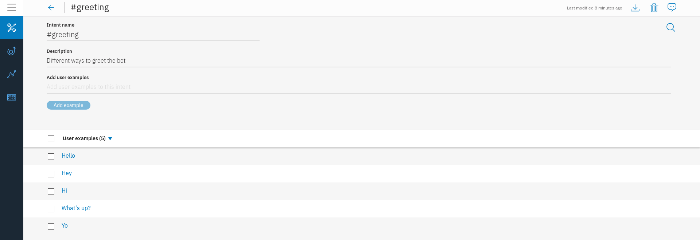

Details about the intent #thankyou
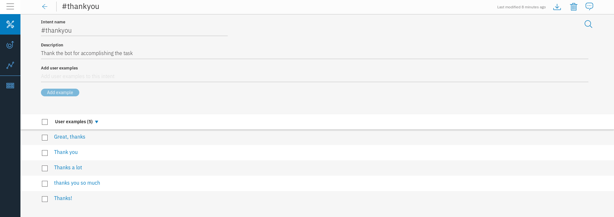

Details about the intent #book_tickets
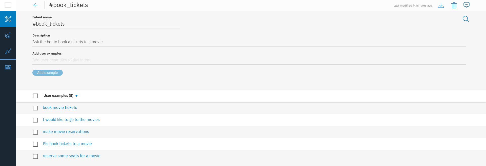

## Define Entities
For the entities, we can define 3 main entities that the user might use: terms related to the category of movies (@movie), examples of movie names (@movie-name), and example of cinema names found in Dubai (@dubai-cinema). For each entity, we will be defining a value and the different synonyms that a person might use by which he/she means the same value.

1.  Under the tab **Entities**, click on **Add entity** that will be under the tab **My entities** (these are the user defined entities).
2.  Enter the **Entity name** and click on **Create entity**.
3. Add the **Value name** and its corresponding **Synonyms** and click on **Add value**. Here, there are restrictions on the number of values and synonyms that can be added.

Details about the entity @movie
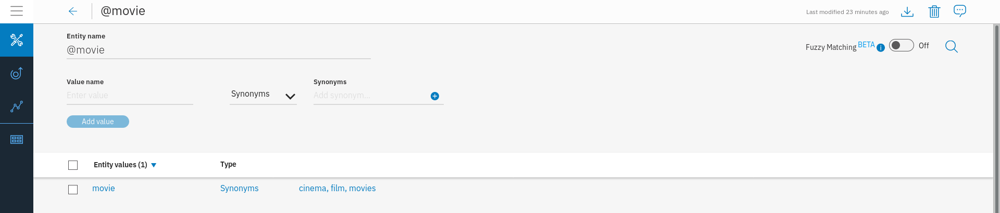

Details about the entity @movie-name
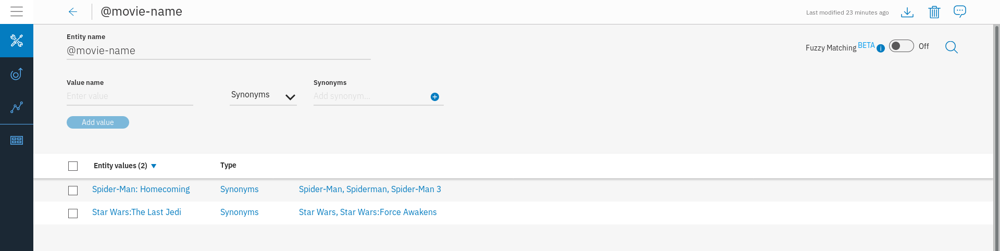

Details about the entity @dubai-cinema
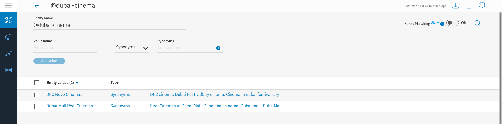

4.  Under **System entities**, whcih are pre-defined entities that can be directly used, enable **sys-date**, **sys-time**, and **sys-number**. These will be used in the dialog to get the date and time of when the user wishes to see the movie and the number of seat he/she wishes to reserve.

## Define Dialog Flow
1.  Click on the tab **Dialog**, where you will see to pre-defined nodes: *Welcome* and *Anything else*.
The *Welcome* has a special condition called **welcome** that is triggered when a converstaion is started by the system. The *Anything else* node has a special condition called **anything_else** that is triggered when the user input does not match any of the conditions in previous nodes.
2.  Click on the *Welcome* node and modify the responses that will determine how the bot first greets the user, as seen in the diagram below.

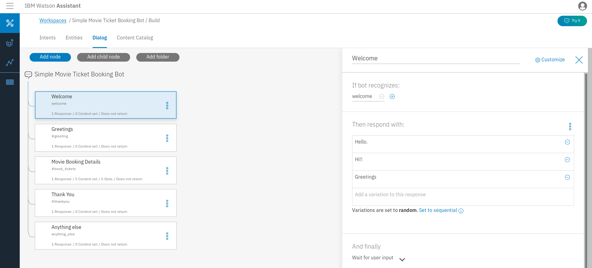

3.  Also, click on **Set to random**, so that the response change everytime the user tries out the bot.
4.  Click on **Add node** to add a node under the *Welcome* node.
5.  Call the node *Greetings* and set the condition under **If bot recognizes** to *#greeting*. This means that, after the welcoming message, if the bot detects that the user is greeting it, it will respond with whatever is added under **Then respond with:** and **wait for user input**, which is indicated under **And finally**.

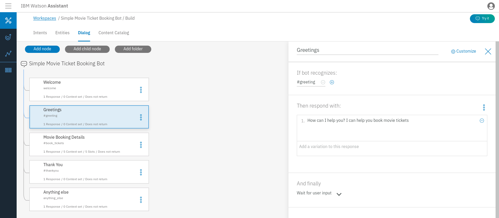

6.  Create a new node and call it *Thank You*, whcih is triggered when *#thankyou* is detected. Complete the rest of the details as follows.

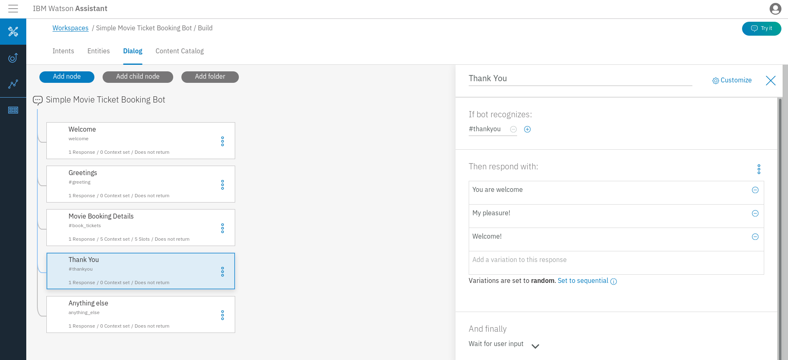

7.  Click on the *Greetings* node and click on **Add node**.
8.  Call the node *Movie Booking Details*. As a name suggests, this is where we will be gathering details about the booking. Fill the node details seen below.

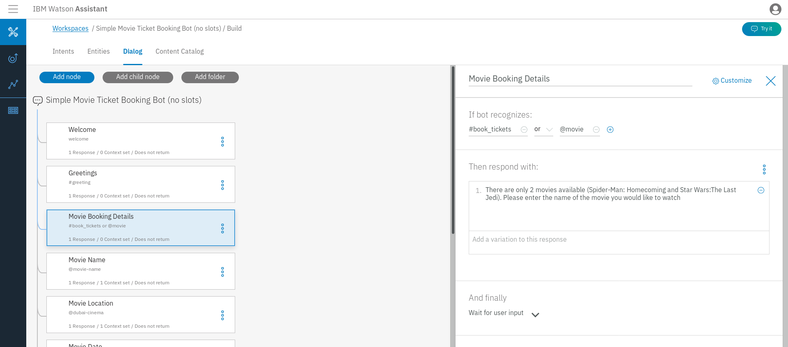

9.  Create a new node below the *Movie Booking Details* node the same way we have previosuly done (or click on the triple dots at the far right of the node and select **Add node below**). Name the new node *Movie Name*.
10.  Fill the details as of the node as illustrated in the image below.

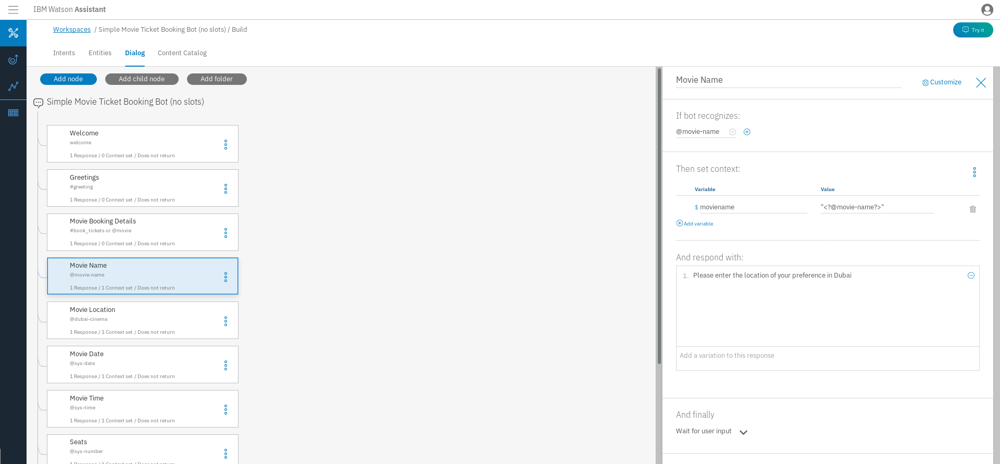

Note that we have created a context variable here called *$moviename*, where we will be storing the movie name enter by the user. <i>"<?@movie-name?>"</i> is written using the Spring Expression Language (SpEL) and extracts the *@movie-name* entity that was entered by the user and saves it into the context variable. This will allow use to use *$moviename* at any point in time during the conversation.

11.  Similarly, we will be creating new nodes to gather information on where the cinema the user wishes to visit(*Movie Location* node), the date and time of the movie (*Movie Date* and *Movie Time* nodes), and the number of seats the user wishes to reserve (*Seats* node). The details of each node is as follows:

*Movie Location* node

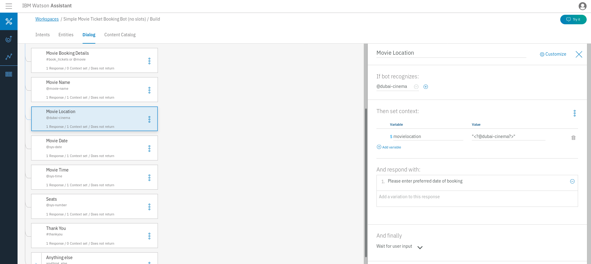

*Movie Date* nodes

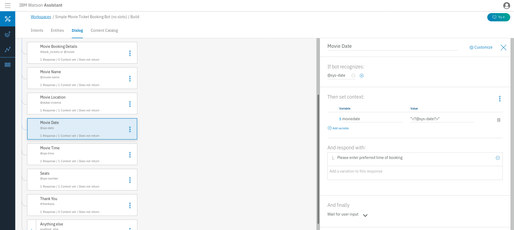

*Movie Time* nodes

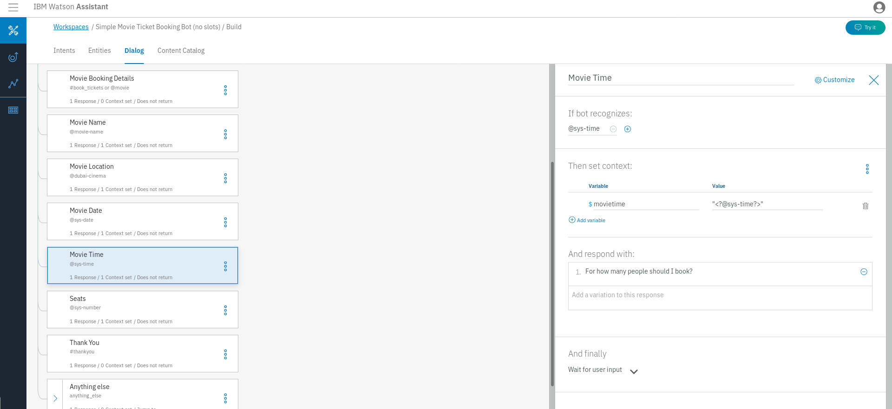

*Seats* node

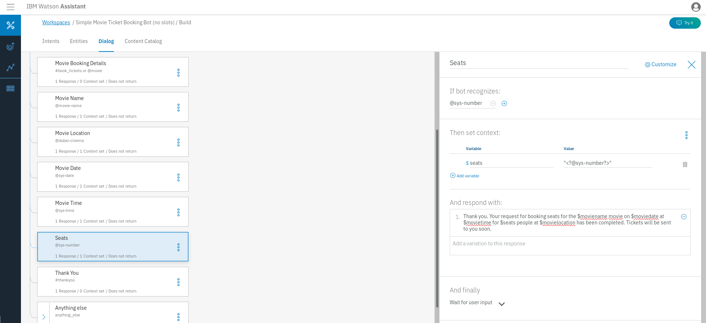

The response under **Then respond with** of the *Seats* node provides the user with a summary of the information he/she provided.

12.  To ask the user again for the movie booking details in case an invalid input is provided such as a movie name that is not available, go to the *Anything else* node and change **Wait for user input** found under **And finally** to **Jump to...**.

13.  Select the *Movie Booking Details* node and choose **Respond**. This will lead to displaying the reponse of the *Movie Booking Details* node and proceding with the conversation from there.

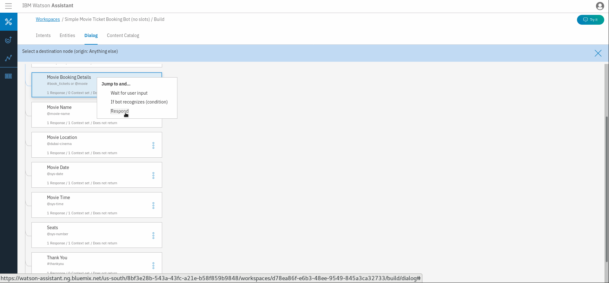

## Try It Out
Next is trying out the flow defined.
1.  Click on the **Try it** button found at the top right of the page.
2.  Start conversing with the chatbot (an example is given below).

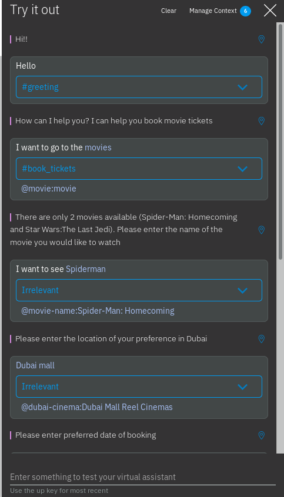
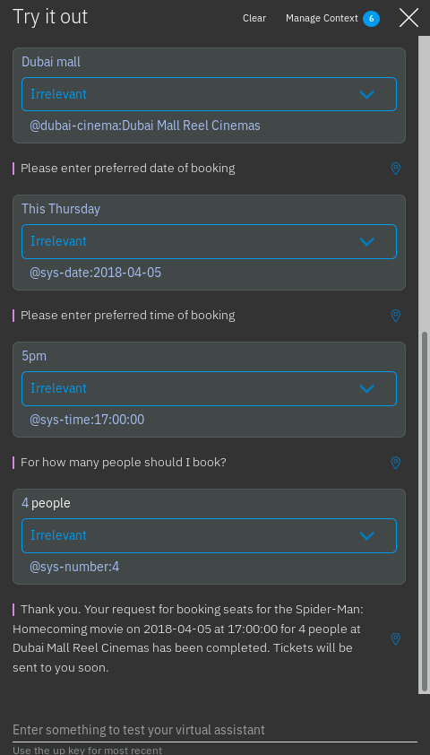

We will notice that the intent for when we mentioned the location and the number of seats is **Irrelevant**. That is because we only mentioned entities, which were labelled correctly. We can adjust the intent and change it from **Irrelevant** to *#book_tickets* based on which the bot will be retrained.

## Importing a workspace
Alternatively, instead of going step-by-step, we can import the entire workspace containing all defined intents, entities and the dialog flow.
1.  In the main page of the Workspaces, click on the arrow found beside **Create** that is next to **Workspaces** title.
2.  Select the file called *SimpleMovieBookingBot.json*, which can be found in this repository.

## Integrate It into an Application and Deploy it to IBM Cloud
This can be done by following the steps found in this [Github repository](https://github.com/watson-developer-cloud/assistant-simple). The difference is that we will be using the Watson Assistant service and workspace we just created.

## Other resources to check out
Bot Asset Exchange (contains workspaces that can be explored)  
https://developer.ibm.com/code/exchanges/bots/

Watson Assistant courses (to help learn about Watson Assistant features)  
https://developer.ibm.com/courses/all/chatbots-watson-lets-talk-national-parks/  
https://developer.ibm.com/courses/all/chatbots-for-good-empathetic-chatbots/  
https://cognitiveclass.ai/courses/how-to-build-a-chatbot/

TJ Bot (contains fun projects to build using some hardware components)  
https://ibmtjbot.github.io/
